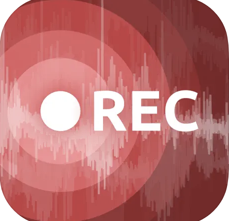
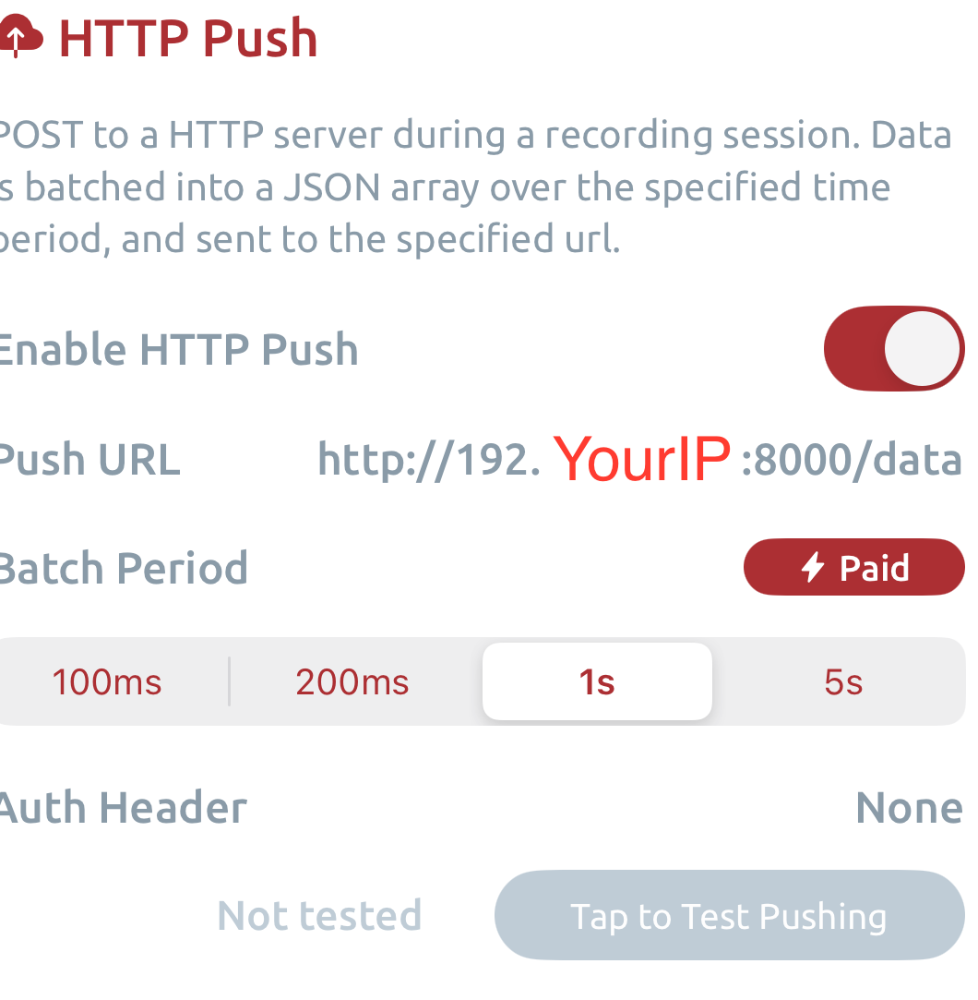
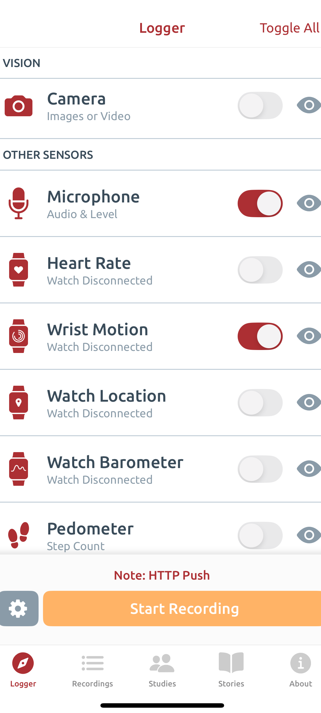
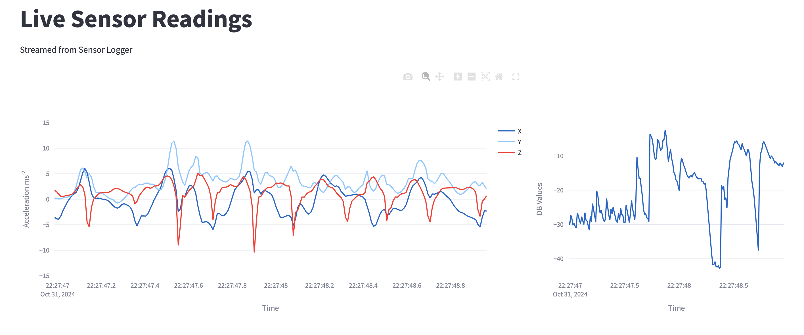

# Human Activity Recognition using Zero-Shot Learning

This project aims to recognize human activities using zero-shot learning techniques. By analyzing segmented portions of Apple Watch wrist motions (accelerometer data: X, Y, Z) and utilizing predefined thresholds for loudness or specific speech cues, we can classify behaviors in real-time.

## Table of Contents

- Project Overview
- Installation
- Demo

## Project Overview

- Real-time human activity recognition
- Zero-shot learning for flexible classification
- Data collection from Apple Watch using the SensorLogger app
- Instantaneous behavior classification using a Large Language Model (LLM)

## Installation

### Prerequisites

- Python >= 3.9
- An Apple Watch with the SensorLogger app installed

### Step 1: Install the SensorLogger App

Download and install the SensorLogger app from the App Store:

[SensorLogger iOS App](https://apps.apple.com/us/app/sensor-logger/id1531582925)

### Step 2: Configure the SensorLogger App
| Open the SensorLogger app on your Apple Watch  | Change the settings to enable HTTP push  | Toggle enable the microphone and wrist motion      |
|------------------------------------------------|-------------------------------------------|-----------------------------------------------------------------|
|  |  |  |


### Step 3: Set Up the Project

1. Clone the repository:
   ```bash
   git clone https://github.com/luciafang/har-dashboard.git
   cd har-dashboard
   ```
2. Create a virtual environment and activate it:
    ```bash
   python -m venv venv
   source venv/bin/activate  # For macOS/Linux
    ```
3. Install dependencies:
    ```bash
   python -m pip install -r requirements.txt
    ```
4. To run the Streamlit application
    ```bash
    streamlit run main.py
   ```

## Demo

